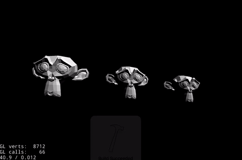
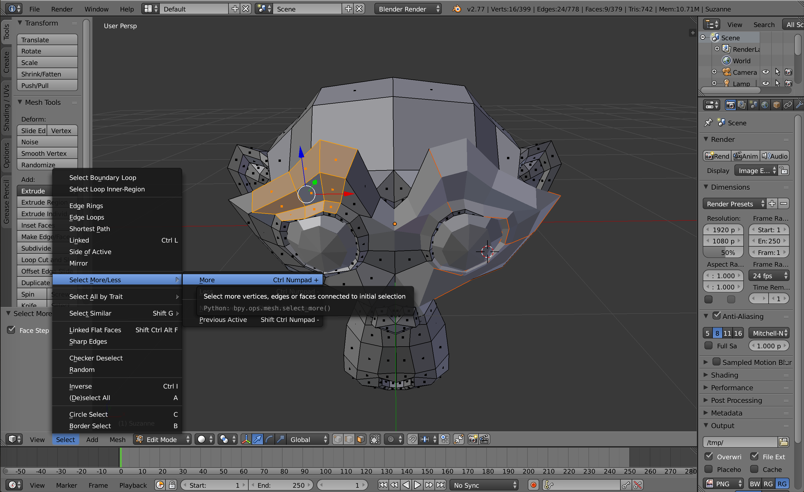
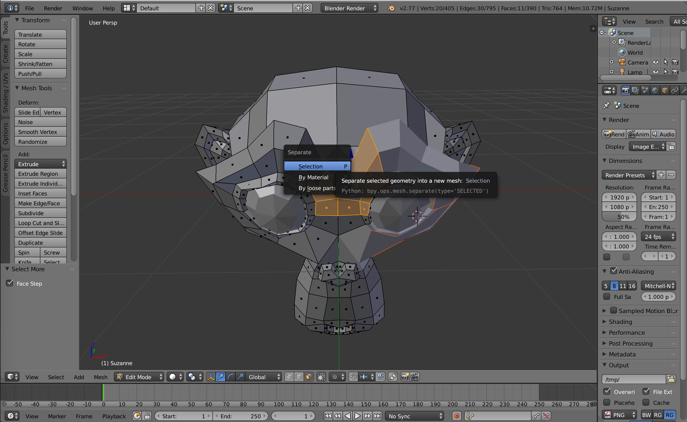

# cocos2dx-explode-animation
Simple object explosion/disassembly animation for cocos2d-x.
Repo contains sample app.
Example:


# how to run sample app
osx - `cocos run -p mac`
ios - `cocos run -p ios`
android - `cocos run -p android`

# how to use

```
	Vec3 crashVector(0,10,0);
	float duration = 10;
	float explosionPower = 1000;
	float gravity = 10000;
	
	auto explodeAnimation = util::Explosion::create(duration, crashVector, explosionPower, gravity);
	// run animation on your node
	node->runAction(explodeAnimation);
```

# NOTE:

Your object needs to be already divided into pieces so it can be exploded. You can use blender to prepare your object.

Go into edit mode, and selection by mesh.
Select one mesh and expand selection:

Hit `p` to expande selection into separate object

Divide whole your object.
Export it to `.obj` or `.fbx` (end then to `.c3b` in order to load it to cocos).